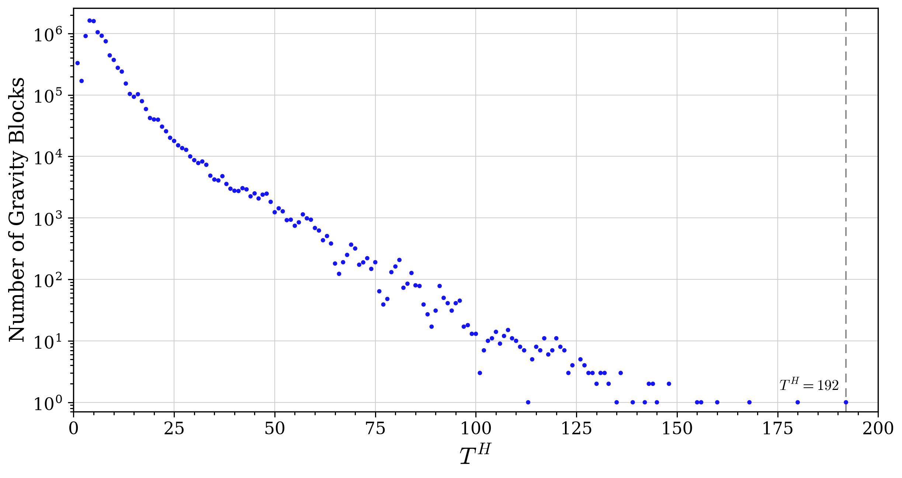
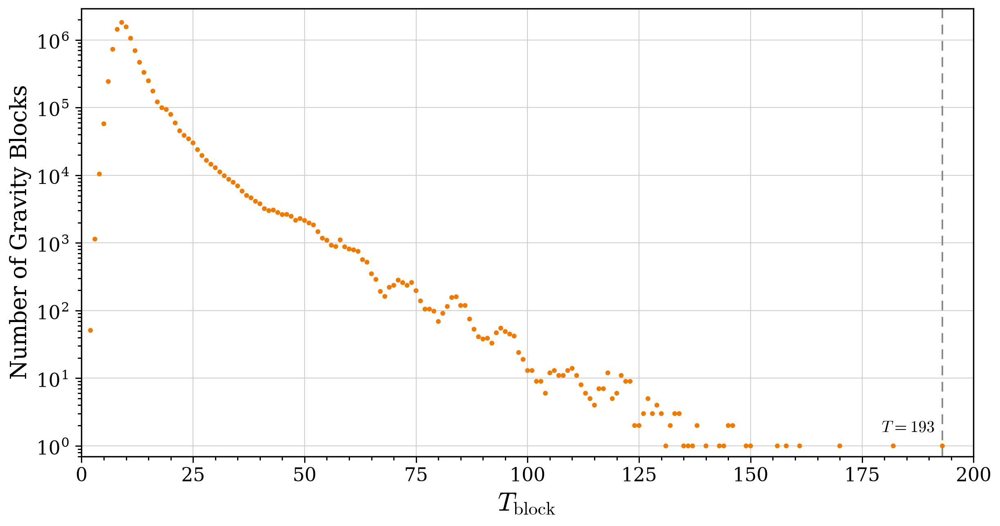
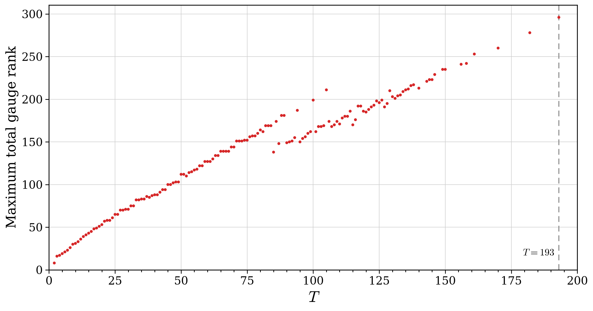
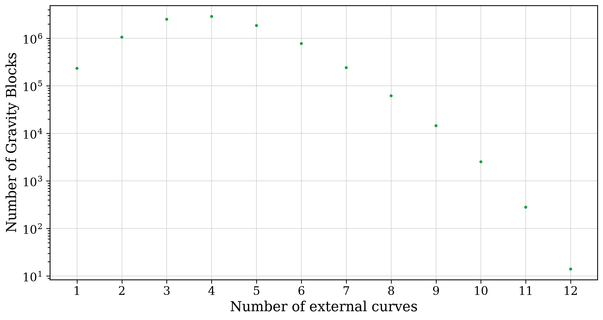
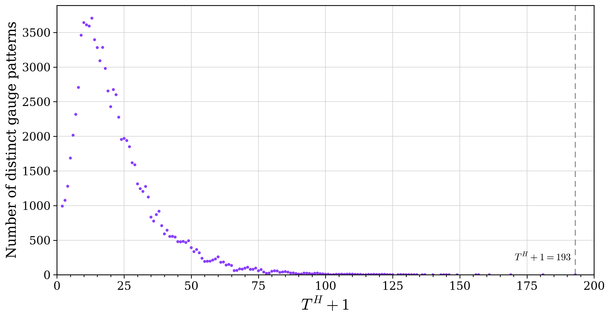
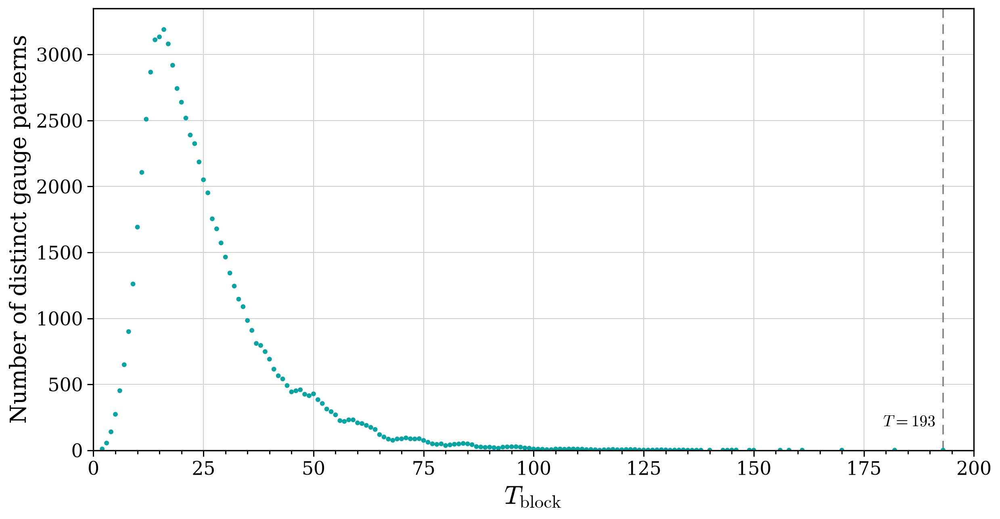

# 6D SUGRA Base Catalog — analysis toolkit

A catalog of 6D supergravity blocks, organized so you can explore it
**by hand, with a spreadsheet, or with a few lines of Python.**

## Requirements

Python 3.9+ and `pip install -r requirements.txt` (just **numpy** + **matplotlib**;
the toolkit is pandas-free). The loader (`sugra.py`) needs only numpy; plotting
needs matplotlib.

## Data layout

One folder per LST tensor number `T_H`, one file per external **combo**:

```
catalog/
  T2_2/   e6.cat   e6+su3.cat   su2+su2.cat   ...
  T3_3/   ...
  ...
```

- **`T<n>_<n>/`** — folder for tensor count `T_H = n`.
- **`<combo>.cat`** — all bases whose external content is that combo
  (e.g. `e6+su3.cat`). The combo is the `+`-joined, sorted external tags.

Each `.cat` file holds many **bases**, one `ENTRY … END` block each. You rarely
need the raw format — see "File format" at the bottom if you do.

## Three ways to use it

### 1. Python loader (`sugra.py`) — flexible queries
```python
import sugra
cat = sugra.Catalog("catalog")          # point at the data folder

cat.tensors()                           # [2, 3, 4, ...] available T_H
cat.combos(8)[:10]                      # combos available at T_H=8

bases = cat.load(8, "e6+su3")           # list of Base objects
b = bases[0]
b.T_H, b.T, b.combo                     # 8, 9, 'e6+su3'
b.tags                                  # ['e6', 'su3']
b.physics                               # {'T':9,'Hc':..,'V':..,'Hn':..,'det':..,'sig':(..)}
b.IF                                    # numpy intersection-form matrix
b.t_min()                               # T_min (None if undefined)

# Don't know the combo? Filter:
cat.find(t_h=8, externals=["e6", "su3"])   # multiset match (order-free)
cat.find(t_h=8, contains="e8")             # any base with an e8 external
cat.find(t_h=5, t_min=8)                   # by T_min
```
No setup, no multiprocessing — safe to use in any script, notebook, or REPL.

### 2. Spreadsheet / pandas — no parsing needed
Build CSV summaries once:
```
python build_index.py catalog          # -> catalog/index.csv + summary.csv
```
- **`index.csv`** — one row per base (T_H, T, combo, Hc, V, Hn, det, sig…).
  Best with pandas (it is large). Add `--tmin` to also compute T_min.
- **`summary.csv`** — one row per (T_H, combo) with base counts. Small; opens
  fine in Excel for a quick overview.

```python
import pandas as pd
df = pd.read_csv("catalog/index.csv")
df[(df.T_H == 8) & (df.combo == "e6+su3")]
df[df.combo.str.contains("e8")].groupby("T_H").size()
```

### 3. Tutorial notebook
`tutorial.ipynb` — runnable, worked examples with explanations.

## Statistics, gauge algebra & plots

Two scanners read the whole catalog and emit summary CSVs:

```
python stats.py          catalog stats_out     # base counts by T_H / combo / LST / gauge
python gauge_analysis.py catalog gauge_out      # full-base gauge algebra + rank, by T / T_H
```
- `stats.py` → `by_T_H.csv`, `by_combo.csv`, `by_LST.csv`, `by_LSTGauge.csv`,
  `classification.csv`. Its `LSTGauge` is the gauge of the LST part (externals
  excluded); NHC clusters matched by eigenvalue spectrum.
- `gauge_analysis.py` → `by_TH_nExt_gauge.csv`, `gauge_patterns_by_THplus1.csv`,
  `gauge_patterns_by_T.csv`, `by_T_summary.csv` (+ scatter PNGs). It reads the
  **full-base** gauge algebra off the intersection form — NHC clusters matched by
  eigenvalue spectrum (the lone `-2` of a `-2-2-3` carries no gauge), `su8`/`su16`
  from `hat1m1`/`hat1m2`, `so16` from `so16n2`.

Turn those CSVs into figures (no re-scan, seconds):
```
python make_plots.py [SRC_DIR] [OUT_DIR]   # publication figures (.png + .pdf), 6 plots
python plots.py                            # quick re-plot, editable STYLE block, 3 plots
```
`make_plots.py` defaults `SRC`/`OUT` to its own directory — drop it next to the
CSVs and run it. Tweak the STYLE block (colours, dpi, markers) and re-run.

Per-external frequency (after `stats.py`):
```
python external_frequency.py stats_out/by_combo.csv   # how often each external appears
```
Counts are per external **object** under the current 1-tag-per-NHC-cluster
policy (one `nhc_2_2_3` cluster = +1, not +3 curves).

Census by gauge algebra (how many blocks contain ≥1 external of each gauge):
```
python count_by_gauge.py "<catalog>" out.csv            # by (gauge, self-int)
python count_by_gauge.py "<catalog>" out.csv --no-nhc   # single-curve externals only
```
Each row = blocks containing at least one external curve of that `(gauge,
self_int)` (counted once per block; `su3n2/su3n2mix → g2`; gauge-less `2`/`1` →
`(none)`); rows overlap so percents don't sum to 100. Precomputed results ship in
`../stats_final/`: `blocks_by_gauge.csv` (incl. NHC-cluster gauges),
`blocks_by_gauge_nonhc.csv` (single-curve only), and `blocks_by_nhc.csv` (per
NHC cluster). `by_combo.csv` there carries a `percent_of_total` column.
`plot_gauge_census.py` turns these into a bar chart (`blocks_per_gauge.png`, y = number
of SUGRA blocks) with single-curve external gauges and NHC clusters as separate bars.
`count_generator_patterns.py` counts distinct **generator (external-combo) patterns**
by external gauge content (`su3n2 → g2`; NHC clusters by their gauges). Tag-based →
**1,188** (`generator_patterns.csv`). With `--exact` it reads the actual IF so a `-2-3`
grown into a `-2-3-2` is scored su2+so7+su2 (not su2+g2) → **1,293**
(`generator_patterns_exact.csv`).

The gauge-less **unit externals** `1` (a `-1`) and `2` (a `-2`) carry no gauge, so
the census above lists them as `(none)`. `external_1_2_analysis.py` tracks them on
their own — `T_block` distribution, co-occurring externals, and a figure:
```
python external_1_2_analysis.py "<catalog>" stats_out
```
Snapshot: `1` appears in **34,900** blocks (always the sole external, `T_block` 2–97),
`2` in **618,880** (top co-external `su2`; `T_block` 5–116). Results in
`../stats_final/external_1_2_*`.

`count_by_nhc_exact.py` **splits the `nhc_2_3` row of `blocks_by_nhc.csv`** into its
three **IF-exact** outcomes: an attached `-2-3` can stay `-2-3` (su2+g2) or GROW in a
later chain step into `-2-3-2` (su2+so7+su2) or `-2-2-3` (sp1+g2). The grown shape is
read off the actual intersection form (the `nhc_2_3` external's connected component,
via its eigenvalue spectrum). `nhc_2_2_3` and `nhc_2_3_2` are **separate attach modes**
(whole clusters glued directly) and are left as their tag counts. Outputs
`blocks_by_nhc_exact.csv`, `nhc_2_3_outcome_by_THplus1.csv` (+ figure),
`nhc_exact_migration.csv`. Snapshot (blocks): `nhc_2_3` stays `-2-3` **1,592,322** /
grew `-2-3-2` **152,320** / grew `-2-2-3` **56,216** (growth begins at `T_H+1` ≥ 3;
the three rows may marginally overlap — a block with two `nhc_2_3` clusters of
different shapes counts in both).

## Frozen blocks

The **frozen** gravity blocks are those carrying a frozen NHC
`hat1m1` (→ `su8`), `hat1m2` (→ `su16`), `su8` (frozen `-2`), `so16n2` (frozen
`-4`). Two tools collect and analyse them:

```
python collect_frozen.py "<catalog>" "<Frozen blocks>"   # pull blocks per frozen external
python frozen_analysis.py "<Frozen blocks>"              # T-distribution, plot, co-gauge CSVs
```

`collect_frozen.py` writes `by_external/<tag>/T<n>_<n>/<combo>.cat` (the explicit
blocks), plus `SUMMARY.txt` and `manifest.csv`. `frozen_analysis.py` then writes
into `<Frozen blocks>/analysis/`:
- `frozen_T_distribution.csv` (+ `_long`) — blocks per `T` (= σ₋ = #negative
  eigenvalues) for each frozen external,
- `frozen_T_vs_blocks.png/.pdf` — one figure, one colour per external,
- `hat1m1_cogauge.csv`, `hat1m2_cogauge.csv` — gauge combos co-occurring with each
  hat1, by frequency.

A ready-made collection ships in **`../Frozen blocks/`** (alongside this toolkit).
Snapshot of the current catalog: `hat1m1` 1,724, `hat1m2` 3, `su8` 9,
`so16n2` 3 (1,739 frozen blocks total). `su8` and `so16n2` — the two `-2-4`
frozen-cluster pieces — never co-occur. The explicit `su8`/`so16n2` forms (12
blocks) and the surviving `hat1m2` blocks (3) are typeset in
`../Frozen blocks/analysis/su8_so16_explicit.tex` and `hat1m2_explicit.tex` (via
`cat2tex`).

## Rebuilding the clean tree from raw archives

If you have the raw per-T archives (or decade zips), produce the clean tree with:
```
python build_clean.py "<raw source>" catalog
```
It reads only the **canonical** catalog directories — `cat_phase1_nhc_merged_*`
and `cat_nhc_ext_nhc_ext_unified_*sext` (covers `sext` and `nsext`) — and skips
the redundant mirror dirs (`cat_1ext_nosu2_*`, `cat_nhc_ext_t*`) and any
`*_nonsugra`. Those mirror dirs are exact subsets of the canonical ones, so no
deduplication is needed (the build reports `dups removed=0`).

## Physics cheat-sheet

- **`T_H`** — tensor count of the underlying Little String Theory (LST) base.
- **`T`**  — tensor count of the extended base (= `sig_neg`); labelled `T_block` in figures.
- **`T_min`** — minimum `T` admitting a SUGRA b0 lift; `None` if undefined.
- **external** — an extra `(-n)` curve glued onto the LST. Tags: `su2`(-2),
  `su3`(-3), `so8`(-4), `f4`(-5), `e6`(-6), `e7p`(-7), `e7`(-8), `e8`(-12),
  plus mixed/special embeddings `su2n3`, `su2n3mix`, `su3n2`, `su3n2mix`,
  `so7`, `so7mix`, …, NHC clusters `nhc_2_3`, `nhc_2_2_3`, `nhc_2_3_2`, and
  Hat-1 externals `hat1m1`, `hat1m2`.
- **`IF`** — intersection-form matrix of the extended base.

## File format (only if you need it)

A `.cat` file is plain text; each base is:
```
ENTRY <id>
COMBO <combo>
EXTERNALS <n>
  <curveIdx> <specId> <tag> <extSI> <targetSI> <intNum> <isHat1>   × n
BASE <catalogId> <catalogType> <baseT(=T_H)> <ifSize>
PHYSICS <T> <Hc> <V> <Hn> <det> <sigPos> <sigNeg> <sigZero>
IF <n>
  <n integers> × n rows
REMAINING <n>
  <curveIdx> <selfInt> <availCC>   × n        (optional)
END
```
The loader parses all of this for you into `Base` objects.

## Statistics and data

Snapshot of the current catalog (`sugra blocks clean final`):

| quantity | value |
|---|---|
| Total gravity blocks | **9,630,606** |
| Tensor range | `T_H` = 1–192   (`T` = σ₋ = 2–193) |
| Peak | `T_H` = 4 — 1,623,870 blocks |
| Max total gauge rank | 296 (at `T` = 193) |
| Distinct gauge patterns | 34,727 |
| External curves / base | 1–12 (most have 3–4) |

Gravity blocks by number of external curves:

| #ext | 1 | 2 | 3 | 4 | 5 | 6 | 7 | 8 | 9 | 10 | 11 | 12 |
|---|---|---|---|---|---|---|---|---|---|---|---|---|
| blocks | 233,252 | 1,055,928 | 2,513,867 | 2,878,780 | 1,854,076 | 774,594 | 241,135 | 61,684 | 14,473 | 2,523 | 280 | 14 |

### Data tables (CSV)

**Catalog-wide** — [`../stats_final/`](../stats_final/):
- [`by_combo.csv`](../stats_final/by_combo.csv) — blocks per external combo (+ `percent_of_total`)
- [`by_LSTGauge.csv`](../stats_final/by_LSTGauge.csv) — blocks per LST gauge algebra
- [`by_LST.csv`](../stats_final/by_LST.csv) — blocks per LST (type, `T_H`, id)
- [`by_T_H.csv`](../stats_final/by_T_H.csv) — blocks per `T_H`
- [`classification.csv.gz`](../stats_final/classification.csv.gz) — (`T_H`, LST gauge, combo) → n
- [`external_frequency.csv`](../stats_final/external_frequency.csv) — per-external frequency
- [`blocks_by_gauge.csv`](../stats_final/blocks_by_gauge.csv) — blocks per (gauge, self-int), incl. NHC-cluster gauges
- [`blocks_by_gauge_nonhc.csv`](../stats_final/blocks_by_gauge_nonhc.csv) — same, single-curve externals only
- [`blocks_by_nhc.csv`](../stats_final/blocks_by_nhc.csv) — blocks per NHC cluster
- [`blocks_by_nhc_exact.csv`](../stats_final/blocks_by_nhc_exact.csv) — `nhc_2_3` split into 3 **IF-exact** outcomes (stays `-2-3` / grew `-2-3-2` / `-2-2-3`); `nhc_2_2_3`,`nhc_2_3_2` kept as tags
- [`nhc_2_3_outcome_by_THplus1.csv`](../stats_final/nhc_2_3_outcome_by_THplus1.csv) — fate of attached `-2-3` per `T_H+1`
- [`nhc_exact_migration.csv`](../stats_final/nhc_exact_migration.csv) — origin tag → exact cluster (#clusters)
- [`external_1_2_summary.csv`](../stats_final/external_1_2_summary.csv) — headline: #blocks with `1` (34,900) / ≥1 `2` (618,880), %, occ, `T_block` range
- [`external_1_2_T_distribution.csv`](../stats_final/external_1_2_T_distribution.csv) — `T_block` dist of gauge-less `1`/`2`
- [`external_1_2_cogauge.csv`](../stats_final/external_1_2_cogauge.csv) — co-occurring externals for `1`/`2`
- [`generator_patterns.csv`](../stats_final/generator_patterns.csv) — distinct generator (external-combo) patterns, tag-based
- [`generator_patterns_exact.csv`](../stats_final/generator_patterns_exact.csv) — same, IF-exact (`-2-3`→`-2-3-2`)

**Gauge / T distributions** — [`../gauge_out/`](../gauge_out/):
- [`by_T_summary.csv`](../gauge_out/by_T_summary.csv) — blocks & max gauge rank per `T` (=σ₋)
- [`by_TH_nExt_gauge.csv.gz`](../gauge_out/by_TH_nExt_gauge.csv.gz) — (`T_H`, #external, gauge) → n
- [`gauge_patterns_by_THplus1.csv.gz`](../gauge_out/gauge_patterns_by_THplus1.csv.gz) — (`T_H+1`, gauge) → n
- [`gauge_patterns_by_T.csv.gz`](../gauge_out/gauge_patterns_by_T.csv.gz) — (`T`=σ₋, gauge) → n

**Frozen blocks** — [`../Frozen blocks/`](../Frozen%20blocks/):
- [`SUMMARY.txt`](../Frozen%20blocks/SUMMARY.txt), [`manifest.csv`](../Frozen%20blocks/manifest.csv)
- [`frozen_T_distribution.csv`](../Frozen%20blocks/analysis/frozen_T_distribution.csv) ([`_long`](../Frozen%20blocks/analysis/frozen_T_distribution_long.csv)) — `T`(=σ₋) vs #blocks per frozen external
- [`hat1m1_cogauge.csv`](../Frozen%20blocks/analysis/hat1m1_cogauge.csv), [`hat1m2_cogauge.csv`](../Frozen%20blocks/analysis/hat1m2_cogauge.csv) — co-occurring gauges
- [`su8_so16_explicit.tex`](../Frozen%20blocks/analysis/su8_so16_explicit.tex) — explicit `su8`/`so16` forms (cat2tex)
- [`hat1m2_explicit.tex`](../Frozen%20blocks/analysis/hat1m2_explicit.tex) — the surviving `hat1m2` blocks (cat2tex)

(Small summary CSVs are also bundled in [`catalog_summary/`](catalog_summary/).)

**≥10-external blocks excluded by the 9-round chain cap** — [`../round10plus_cap9_excluded/`](../round10plus_cap9_excluded/): the 400 blocks the chain makes past round 9 (all invalid su2/su3-stacking without `su2n3` partners; [`summary.csv`](../round10plus_cap9_excluded/summary.csv), [`README.txt`](../round10plus_cap9_excluded/README.txt)). Evidence that cap-9 loses no valid data.

### Figures

Regenerate with `python make_plots.py` (writes `.png` + `.pdf`). Full set in
[`../gauge_out/`](../gauge_out/):
[blocks vs `T_H`](../gauge_out/Number_GBs_by_TH_log.png) ·
[blocks vs `T`](../gauge_out/Number_GBs_by_T_log.png) ·
[max gauge rank vs `T`](../gauge_out/maxrank_by_T.png) ·
[blocks vs #external](../gauge_out/Number_GBs_by_nExternal.png) ·
[distinct patterns vs `T_H+1`](../gauge_out/Number_distinct_patterns.png) ·
[distinct patterns vs `T`](../gauge_out/Number_distinct_patterns_by_T.png) —
plus [blocks per external](../stats_final/blocks_per_gauge.png),
[external frequency](../stats_final/external_frequency.png) and
[frozen `T` vs #blocks](../Frozen%20blocks/analysis/frozen_T_vs_blocks.png).
Also [unit externals `1`/`2` vs `T_block`](../stats_final/external_1_2_vs_Tblock.png).
Also [fate of `-2-3` per `T_H+1`](../stats_final/nhc_2_3_outcome_by_THplus1.png).

Inline previews:







